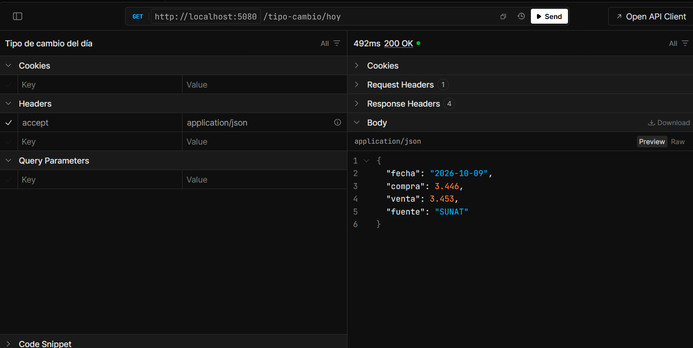

# API de tipo de cambio oficial (SUNAT / BCRP)

API que entrega el tipo de cambio oficial del dólar en Perú y guarda un histórico diario.
Consulta a SUNAT y, si SUNAT no responde, usa automáticamente los datos del BCRP. Cada día se guarda
una sola vez, así que las consultas siguientes no dependen de que las fuentes externas estén disponibles.



## Cómo ejecutarlo

Requisito: [SDK de .NET 9](https://dotnet.microsoft.com/download/dotnet/9.0). No hace falta instalar
ninguna base de datos.

```bash
git clone https://github.com/rmm-01/tipo-cambio-pe.git
cd tipo-cambio-pe
dotnet run --project src/TipoCambio.Api --launch-profile http
```

Se abre el navegador en `http://localhost:5080/scalar`, donde se pueden probar los endpoints.
La primera ejecución crea el archivo `tipocambio.db` (SQLite) y su tabla.

## Endpoints

### `GET /tipo-cambio/hoy`

```json
{ "fecha": "2026-10-09", "compra": 3.446, "venta": 3.453, "fuente": "SUNAT" }
```

| Código | Cuándo |
|---|---|
| 200 | Valor de SUNAT, o del BCRP si SUNAT no respondió |
| 503 | Ninguna de las dos fuentes está disponible |

Cuando responde el BCRP, `fecha` puede ser anterior a hoy: el BCRP publica con unos días de retraso.
La respuesta siempre dice la fecha real del valor y de qué `fuente` viene.

### `GET /tipo-cambio/historico?desde=2026-10-01&hasta=2026-10-31`

Devuelve los días guardados en ese rango, ordenados por fecha. Responde 400 si `desde` es posterior a
`hasta` o si el rango supera 366 días.

## Decisiones técnicas

**SUNAT como fuente principal y BCRP como respaldo.** SUNAT publica un TXT con el valor del día
(`https://www.sunat.gob.pe/a/txt/tipoCambio.txt`). El BCRP tiene una API pública con la misma serie
(tipo de cambio SBS), pero con retraso. `ProveedorConRespaldo` intenta con SUNAT y, solo si SUNAT falla,
consulta al BCRP. El resto de la aplicación ve un único `ITipoCambioProveedor`.

**El respaldo nunca guarda un valor con una fecha que no le corresponde.** Si el BCRP devuelve el dato
del 06/10, se guarda como 06/10. El día de hoy sigue sin valor, así que la siguiente consulta vuelve a
intentar con SUNAT.

**Solo "fuente no disponible" activa el respaldo.** Un error de red, un tiempo de espera agotado o una
respuesta con formato inesperado se convierten en `ProveedorNoDisponibleException`. Cualquier otro error
es un defecto del código y debe verse, no esconderse detrás del respaldo.

**503 y no 500 cuando fallan las fuentes.** El problema está en un servicio externo, no en esta API.
El cliente puede reintentar más tarde.

**SQLite en lugar de SQL Server.** La API escribe una vez al día y solo ella usa la base. SQLite no
requiere instalar nada y basta con `dotnet run`. El acceso a datos está aislado en `TipoCambio.Datos`
con Entity Framework Core, así que pasar a SQL Server es cambiar `UseSqlite` por `UseSqlServer` y
regenerar la migración.

**Un valor por día, garantizado por la base.** La tabla tiene un índice único en `Fecha`. Si dos
peticiones intentan guardar el mismo día a la vez, la segunda choca con el índice y el repositorio lo
trata como "ya estaba guardado".

**La fecha se calcula en hora de Perú (UTC-5)**, no con la zona horaria del servidor. A las 02:00 UTC
del 10/10 todavía es 09/10 en Lima.

**Los números se leen con `InvariantCulture`.** SUNAT y el BCRP usan punto decimal. En un Windows
configurado en español, `decimal.Parse("3.446")` puede interpretar el punto como separador de miles.

**El BCRP exige la cabecera `User-Agent`.** Sin ella responde 200 con una página HTML en lugar del JSON.
Los dos clientes HTTP envían `TipoCambioPe/1.0`.

**La documentación interactiva (Scalar) solo existe en desarrollo.** En producción `/scalar` y
`/openapi/v1.json` responden 404.

### Qué quedó fuera

- **Carga automática diaria.** Hoy un día se guarda cuando alguien consulta `/hoy`. Un `BackgroundService`
  podría consultarlo cada mañana para que el histórico no tenga huecos.
- **Relleno del histórico desde el BCRP.** La API del BCRP devuelve rangos, así que se podría completar
  el histórico de meses anteriores en una sola llamada.
- **Reintentos con espera** (por ejemplo, con Polly) antes de pasar al respaldo.

## Estructura

```
src/
  TipoCambio.Core/    Modelo, reglas y clientes de SUNAT y BCRP (sin dependencia de la base)
  TipoCambio.Datos/   Entity Framework Core + SQLite, migraciones y repositorio
  TipoCambio.Api/     Minimal API, configuración e inyección de dependencias
tests/
  TipoCambio.Tests/   Pruebas con xUnit
```

## Pruebas

```bash
dotnet test
```

59 pruebas, sin acceso a internet:

- **Parsers de SUNAT y BCRP:** formatos válidos e inválidos, días sin dato (`n.d.`), meses en español,
  independencia de la cultura del sistema.
- **Clientes HTTP:** errores HTTP, tiempo de espera agotado, cancelación y respuestas inesperadas,
  simulados con un `HttpMessageHandler` falso.
- **Respaldo:** SUNAT responde, SUNAT falla y BCRP responde, ambos fallan, y un error inesperado que no
  debe activar el respaldo.
- **Repositorio y servicio:** sobre SQLite real en memoria. Incluye la caché, el caso en que el respaldo
  devuelve un día anterior y dos peticiones que guardan la misma fecha a la vez.

## Fuentes

- SUNAT: [tipo de cambio en TXT](https://www.sunat.gob.pe/a/txt/tipoCambio.txt)
- BCRP: [API de BCRPData](https://estadisticas.bcrp.gob.pe/estadisticas/series/ayuda/api), series
  `PD04639PD` (compra) y `PD04640PD` (venta)

## Licencia

[MIT](LICENSE)
